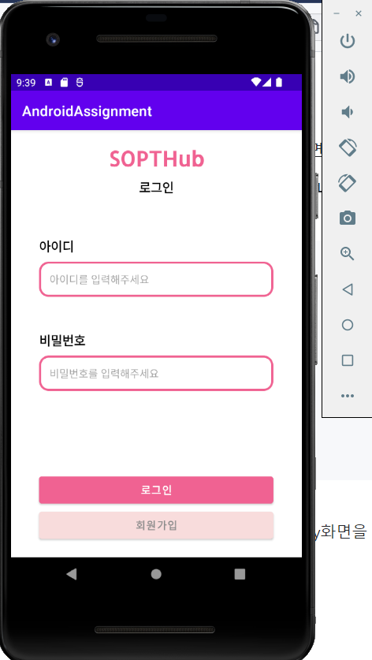
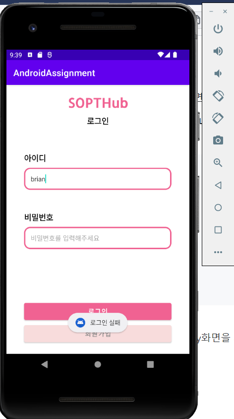
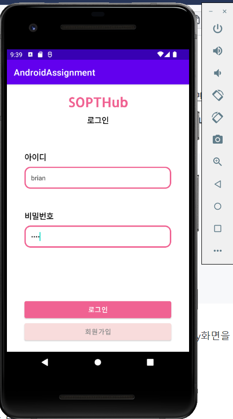
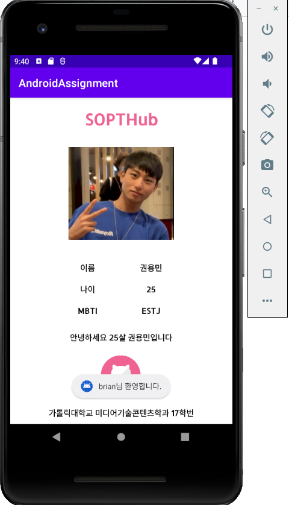
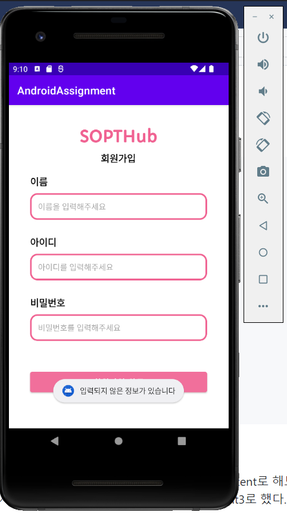
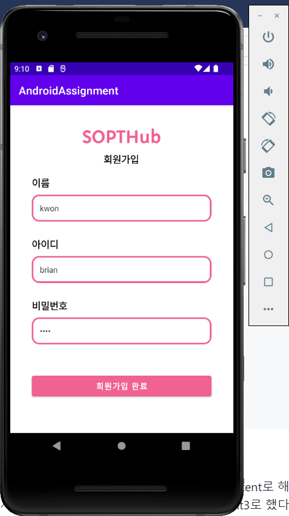

# LEVEL1
### SOPTHub 로그인 페이지 만들기(SignInActivity.kt)



<br>
_깃허브에서 몇 시간동안 열심히 쓴 리드미를 push실수로 다 날려버리고 다시 쓰는 리드미.. 울면서 쓰는 리드미.._
```
val intent = Intent(this, HomeActivity::class.java)
        binding.btLogin.setOnClickListener{
            var str = binding.etId.getText()
            var pw = binding.etPw.getText()
            if(!str.isEmpty() && !pw.isEmpty()){
                Toast.makeText(this, "${str}님 환영합니다.", Toast.LENGTH_SHORT).show()
                startActivity(intent)
            }
            else{
                Toast.makeText(this, "로그인 실패", Toast.LENGTH_SHORT).show()
            }
        }
```
EditText에 입력된 내용을 getText를 통해 변수 str, pw에 저장한다.<br>
if문을 통해 isEmpty를 이용해 str과 pw가 모두 비어있지 않으면 환영한다는 Toast메시지와 함께 HomeActivity로 화면을 전환한다.<br>
else문을 통해 그렇지 않으면(str 혹은 pw가 비어있으면) 로그인 실패라는 Toast메시지를 출력한다.<br><br>
EditText에 넣어야할 미리보기 글자는 text가 아닌 hint속성을 추가하고 hint에 넣고 싶은 것을 작성하면 된다.<br>
비밀번호는 보이지 않아야 하므로 EditText의 inputType속성을 numberPassword로 설정한다.<br><br>
```
val intent2 = Intent(this, SignUpActivity::class.java)
        binding.btSignin.setOnClickListener{
            startActivity(intent2)
        }
```
binding으로 버튼에 접근해 setOnClickListener를 사용해서 버튼이 눌렸을 경우 startActivity(intent2)가 실행돼 SignUpActivity로 화면이 전환된다.<br><br><br>

### SOPTHub 회원가입 페이지 만들기(SignUpActivity.kt)

<br>
```
        binding.btSu.setOnClickListener {
            var name = binding.etName.text
            var id = binding.etSuId.text
            var pw = binding.etSuPw.text

            if(!name.isEmpty() && !id.isEmpty() && !pw.isEmpty()){
                Toast.makeText(this, "가입되었습니다", Toast.LENGTH_SHORT).show()
                finish()
            }
            else{
                Toast.makeText(this, "입력되지 않은 정보가 있습니다", Toast.LENGTH_SHORT).show()
            }
        }
```
SignInActivity에서와 같이 먼저 EditText로부터 입력된 정보를 받아 변수에 저장한다. <br>
_어라..? 근데 왜 위에선 getText()쓰고 여기선 text()를 썼지..? 분명 위에선 text()가 안 됐던 것 같은데..._<br>
그리고 if문에서 isEmpty함수를 이용해 모든 변수들이 비어있지 않은지 체크하고 Toast메시지로 가입되었다고 띄운 후 finish로 SignUpActivity를 끝내고 SignInActivity로 돌아간다.<br>
<br><br>

### SOPTHub 자기소개 페이지 만들기(HomeActivity.kt)
<br>
*LEVEL1을 마치고 캡쳐했어야했는데 LEVEL2과제를 마치고 캡쳐를 해버려서 버튼까지 있습니다,,*<br>
최대한 과제와 비슷하게 만들기 위해 textSize, fontFamily, textStyle, textColor를 설정해주었습니다.<br><br><br><br>

# LEVEL2

