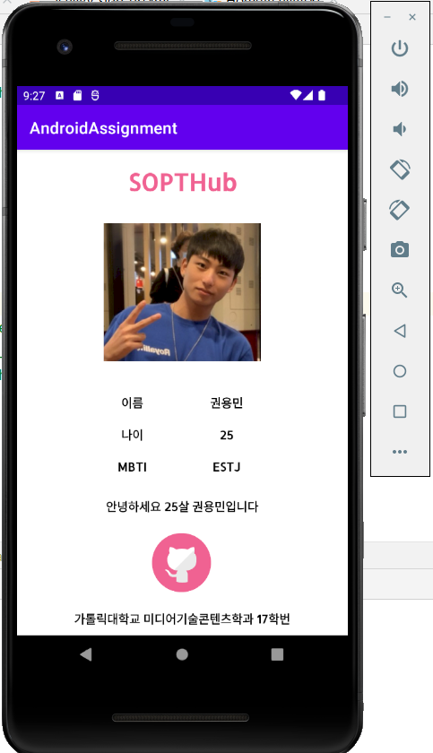
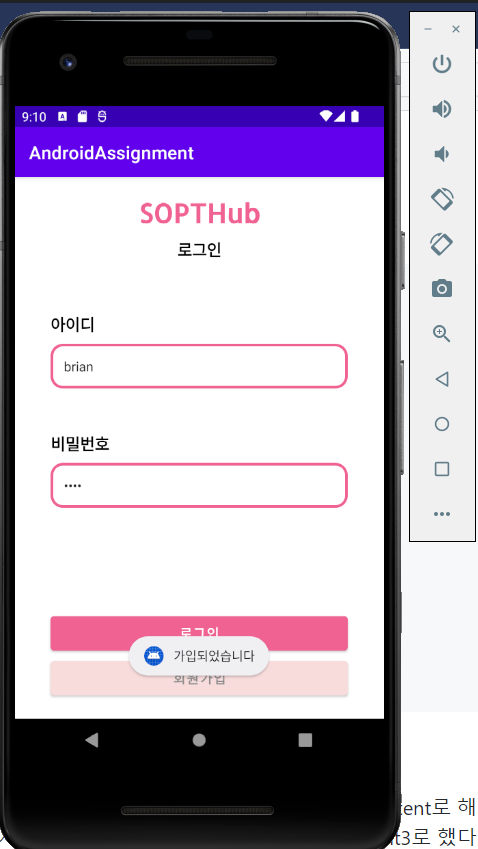
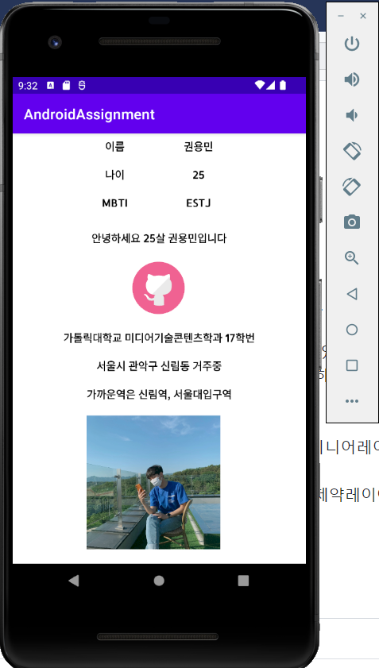

# LEVEL1
### SOPTHub 로그인 페이지 만들기(SignInActivity.kt)
<br>
_깃허브에서 몇 시간동안 열심히 쓴 리드미를 push실수로 다 날려버리고 다시 쓰는 리드미.. 울면서 쓰는 리드미.._
```
val intent = Intent(this, HomeActivity::class.java)
        binding.btLogin.setOnClickListener{
            var str = binding.etId.getText()
            var pw = binding.etPw.getText()
            if(!str.isEmpty() && !pw.isEmpty()){
                Toast.makeText(this, "${str}님 환영합니다.", Toast.LENGTH_SHORT).show()
                startActivity(intent)
            }
            else{
                Toast.makeText(this, "로그인 실패", Toast.LENGTH_SHORT).show()
            }
        }
```
EditText에 입력된 내용을 getText를 통해 변수 str, pw에 저장한다.<br>
if문을 통해 isEmpty를 이용해 str과 pw가 모두 비어있지 않으면 환영한다는 Toast메시지와 함께 HomeActivity로 화면을 전환한다.<br>
else문을 통해 그렇지 않으면(str 혹은 pw가 비어있으면) 로그인 실패라는 Toast메시지를 출력한다.<br><br>
EditText에 넣어야할 미리보기 글자는 text가 아닌 hint속성을 추가하고 hint에 넣고 싶은 것을 작성하면 된다.<br>
비밀번호는 보이지 않아야 하므로 EditText의 inputType속성을 numberPassword로 설정한다.<br><br>
```
val intent2 = Intent(this, SignUpActivity::class.java)
        binding.btSignin.setOnClickListener{
            startActivity(intent2)
        }
```
binding으로 버튼에 접근해 setOnClickListener를 사용해서 버튼이 눌렸을 경우 startActivity(intent2)가 실행돼 SignUpActivity로 화면이 전환된다.<br><br><br>

### SOPTHub 회원가입 페이지 만들기(SignUpActivity.kt)
<br>
```
        binding.btSu.setOnClickListener {
            var name = binding.etName.text
            var id = binding.etSuId.text
            var pw = binding.etSuPw.text

            if(!name.isEmpty() && !id.isEmpty() && !pw.isEmpty()){
                Toast.makeText(this, "가입되었습니다", Toast.LENGTH_SHORT).show()
                finish()
            }
            else{
                Toast.makeText(this, "입력되지 않은 정보가 있습니다", Toast.LENGTH_SHORT).show()
            }
        }
```
SignInActivity에서와 같이 먼저 EditText로부터 입력된 정보를 받아 변수에 저장한다. <br>
_어라..? 근데 왜 위에선 getText()쓰고 여기선 text()를 썼지..? 분명 위에선 text()가 안 됐던 것 같은데..._<br>
그리고 if문에서 isEmpty함수를 이용해 모든 변수들이 비어있지 않은지 체크하고 Toast메시지로 가입되었다고 띄운 후 finish로 SignUpActivity를 끝내고 SignInActivity로 돌아간다.<br>
<br><br>

### SOPTHub 자기소개 페이지 만들기(HomeActivity.kt)
<br>
*LEVEL1을 마치고 캡쳐했어야했는데 LEVEL2과제를 마치고 캡쳐를 해버려서 버튼까지 있습니다,,*<br>
최대한 과제와 비슷하게 만들기 위해 textSize, fontFamily, textStyle, textColor를 설정해주었습니다.<br><br><br><br>

# LEVEL2
### 화면이동+@
<br>
```
        binding.btSu.setOnClickListener {
            var name = binding.etName.text
            var id = binding.etSuId.text
            var pw = binding.etSuPw.text

            if(!name.isEmpty() && !id.isEmpty() && !pw.isEmpty()){
                val intent3 = Intent(this, SignInActivity::class.java)
                intent3.putExtra("id", id.toString())
                intent3.putExtra("pw", pw.toString())
                startActivity(intent3)
                Toast.makeText(this, "가입되었습니다", Toast.LENGTH_SHORT).show()
                finish()
            }
            else{
                Toast.makeText(this, "입력되지 않은 정보가 있습니다", Toast.LENGTH_SHORT).show()
            }
        }
```
LEVEL1 과제에 몇 줄이 추가되었다. intent3이 선언되었고, putExtra가 이용되었다.<br>
LEVEL1과 같이 binding을 통해 버튼에 접근하여 setOnClickListener로 버튼 클릭을 감지한다.<br>
if문을 사용해 세 개의 EditText 중에서 빈 곳이 없는지 확인하고 내용을 수행한다.<br>
SignUpActivity에서 SignInActivity으로 향하는 intent3를 선언한다. 그리고 putExtra를 통해 "id"와 "pw" 키워드에 EditText에서 받아온 입력 정보를 저장한다.<br>
startActivity를 통해 SignInActivity로 화면이 전환되고 Toast 메시지를 출력한 뒤 finish로 SignUpActivity를 종료시킨다.<br>
모든 EditText 중 하나라도 비어있을 경우 else로 가서 해당 Toast 메시지를 출력하고 아무 일도 일어나지 않는다.<br><br>

```
        val id = getIntent().getStringExtra("id")
        val pw = getIntent().getStringExtra("pw")

        binding.etId.setText(id)
        binding.etPw.setText(pw)
```
SignInActivity로 화면이 전환되고 SignInActivity에서 getIntent와 getStringExtra를 통해서 아까 putExtra로 저장한 정보들을 받아온다.<br>
그리고 setText 함수를 통해서 EditText에 넣어준다.<br><br>

이렇게 구현은 완료했지만 사실 아직 intent의 개념에 대해 잘 모르는 것 같다. extra의 경우도 정확히 이해한 것 같지 않다.<br>
SignUpActivity에서 intent3를 선언하면서 고민했다. SignInActivity에 intent와 intent2가 선언되어 있으니 intent3으로 선언해야하나? 아닌가 겹쳐도 상관없나? 아니지 겹치면 안되겠지?<br>
근데 intent3으로 넘기긴 넘겼는데 SignInActivity에서는 어떻게 받지? 아 getIntent로 받았네? 그럼 만약에 SignUpActivity말고 다른 액티비티에서도 Intent로 넘기면 그건 어떻게 되는거지?<br>
똑같이 getIntent를 쓰고 둘중에 최근에 넘겨진걸로 받는건가..?<br>
putExtra는 어디에 어떻게 저장한거지..? 아직 의문 투성이이다... 일단 구현은 했는데... 기초를 더 쌓아가야겠다<br><br><br>

### 명시적 인텐트? 암시적 인텐트?
<br>
*과제의 사진과 비슷하게 만드려고 했다. 그래서 핑크색 깃허브 로고도 만들고 버튼에 이미지 넣는 법도 찾아서 넣어보았다.*<br>
```
        binding = ActivityHomeBinding.inflate(layoutInflater)
        val address : Intent = Uri.parse("https://github.com/briandr97").let{webpage->Intent(Intent.ACTION_VIEW, webpage)}
        //val webIntent = Intent(Intent.ACTION_VIEW, Uri.parse("https://github.com/briandr97"))

        binding.btHomeGit.setOnClickListener{
            //val intent = Intent(Intent.ACTION_SEND)
            //val title = resources.getString(R.string.chooser_title)
            //val chooser = createChooser(intent, title)
            try{
                startActivity(address)
            }catch(e:ActivityNotFoundException){
                Toast.makeText(this, "실행할 수 있는 앱이 없습니다.", Toast.LENGTH_SHORT).show()
            }
        }
```
코드를 보면 주석이 많다. 이 주석에는 많은 사연이 있다.<br>
우선 코드 설명을 먼저 하면.. 사실 잘 이해는 못했다. 안드 디벨로퍼를 열심히 뒤지다가 Uri.parse를 이용하는 것을 알게 되었다.<br>
address라는 인텐트를 선언하고 Uri.parse라는 함수로 웹페이지 주소를 저장하는 것 같다.<br>
그리고 버튼이 눌렸을 때 address 인텐트를 startActivity로 실행시켜주면 웹페이지가 나오게 된다.<br><br>

그렇다면 저 영문을 알수 없는 주석들은 무엇인가...<br>
처음에 주석이 없는 코드로 작성했다. 그리고 버튼을 눌렀는데 크롬이 켜지면서 되나 싶었지만<br>
우측 상단에 에뮬레이터의 크롬이 업데이트가 필요하다고 나오면서 인터넷 연결이 되다 말았다.<br>
처음에는 에뮬레이터가 인터넷이 안되나해서 인터넷 연결 방법을 계속 찾아봤지만 에뮬레이터의 크롬앱이 아닌 구글앱을 켜보니 인터넷 연결이 되는 것을 알 수 있었다.<br>
저 주석들은 그 때부터 버튼을 눌렀을 때 자동으로 크롬앱으로 연결되지 않고 다른 앱을 선택할 수 있도록 하는 방법들을 찾다가 추가된 코드들이다.<br>
주석처리가 된 것을 보면 알 수 있듯이 결국 다른 앱을 선택할 수 있도록 하는 것은 실패했다.<br>
정말 찾고 찾고 찾다가 발견한 방법은 에뮬레이터의 설정앱에서 크롬앱을 disable 시켜주는 것이었다.<br>
크롬을 disable 시켜주고나니 버튼을 눌렀을 때 다른 알 수 없는 앱으로 인터넷이 연결되며 깃허브가 나왔다. 정말 감격의 순간이었다.<br><br>

**명시적 인텐트와 암시적 인텐트의 차이**<br>
인텐트는 안드로이드 구성요소간의 소통에 사용되는 간단한 메시지 객체이다.<br>
인텐트에는 두 가지가 있는데 명시적 인텐트와 암시적 인텐트이다.<br>
명시적 인텐트는 특정한 타겟에 구체적인 메시지를 보낼 수 있다.<br>
암시적 인텐트는 작업을 처리할 앱이나 액티비티가 무엇인지 모르고 액티비티를 시작하는 것이다.<br>
예를 들어 우리가 만드는 앱에서 사진을 찍어야할 때 우리는 보통 어떤 앱이나 액티비티가 그 작업을 수행하는지 신경쓰지 않는다.<br>
[출처: android developer](https://developer.android.com/codelabs/kotlin-android-training-start-external-activity?index=..%2F..android-kotlin-fundamentals&hl=ko#4)<br>
<br><br>

### 사진 비율 지정 + 스크롤뷰 추가
<br>
```
app:layout_constraintDimensionRatio="1:1"
```
사진 비율은 해당 imageView에 layout_constraintDimensionRatio를 추가해 지정해줄 수 있다.<br>
다만 사진 크기를 수치로 지정해놓으면 안 됐던 것 같다. 나는 0dp로 했다.<br><br>

스크롤뷰에서는 정말 애를 많이 먹었다.<br>
바로 앞에서 버튼을 추가하고 그 밑에 스크롤 뷰를 추가하려고했다. 그런데 잘 안돼서 네스티드 스크롤뷰를 추가해보았다.<br>
여차여차해서 성공한듯 했지만 버튼 아래쪽 공간만 스크롤이 되는 모습을 발견할 수 있었다.<br>
정말 수많은 구글링을 하면서 스크롤뷰는 리니어 레이아웃에서 많이 쓴다는 것을 보고 리니어 레이아웃으로 바꿔야하나 했지만 그러면 이번 과제인 사진 비율정하는 부분이 들어갈 수 없었다.<br>
그래서 아 이건 제약 레이아웃으로 해야하는 과제구나라고 생각하고 다시 했다. 결국 내용물을 다 비우고 전체 화면에 스크롤뷰를 넣어봐야겠다는 생각이 들었다.<br>
제약 레이아웃 - 네스티드 스크롤뷰 - 제약 레이아웃 - 내용물들 순으로 배치했다.<br>
이번에 스크롤 뷰를 추가하면서 안 사실은 스크롤 뷰는 하나의 자식밖에 갖지 못하므로 여러 내용물을 추가하고 싶다면 무조건 스크롤뷰 안에 레이아웃을 넣어야한다는 것이다.<br><br><br><br>

과제 후기<br>
사실 엄청 어려운 과제는 아니었을 것 같다.. 내가 기초만 탄탄했다면<br>
기초가 없어서 너무너무 어려웠던 것 같다. 우선 인텐트 뷰바인딩 개념부터 다시 익혀봐야겠다. putExtra와 웹페이지 불러오기도 어쩌다 한 느낌이 강하다.<br>
사실상 제대로 알고 한 건 스크롤뷰, finish, EditText가 모두 채워져있을 때만 승인 이 정도인 것 같다.<br>
정말 정말 LEVEL3까지 풀고싶었는데 아직 무리인 것 같다. 하필 시험기간이랑 겹치네 ㅠㅠ<br>
개념을 쌓다 보면 몇 주차 뒤엔 모든 과제를 할 수 있지 않을까? 하는 행복회로를 돌리며 내일도 화이팅 해야겠다.<br><br>

+깃은 너무 어렵다. 이 리드미.. 두 번째로 쓰고있다.. 먼저 쓴걸 훨씬 열심히 썼는데.. 현재시각 오전7시.. 이제 자야겠다...<br>