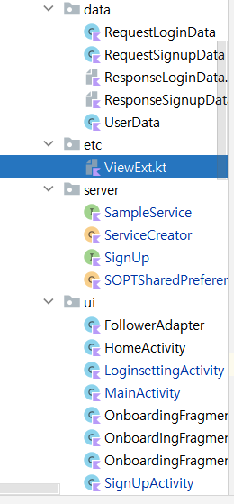

# 7주차 과제

### 1. 온보딩 화면 만들기
fragment 세 개를 만들고 fragment를 담을 activity와 res폴더에 navigation파일을 만듭니다.

navigation파일에서 fragment 세 개와 온보딩 이후 접속될 mainActivity를 추가하고 드래그앤드롭으로 연결합니다.

그리고 각 프레그먼트에서 버튼의 setOnClickListener에서 findNavController를 이용해서 action을 지정해줍니다.
```
binding.tvNextbutton.setOnClickListener{  
  findNavController().navigate(R.id.action_onboardingFragment3_to_mainActivity)  
    (activity as StartActivity).finish()  
}
```
그리고 위처럼 finish를 이용해서 액티비티를 종료시켜줍니다.


### 2. SharedPreferences 활용해서 자동로그인/자동로그인 해제 구현하기

```
package org.sopt.study.againassignment.server  
  
import android.content.Context  
import android.content.SharedPreferences  
  
object SOPTSharedPreferences {  
    private const val USER_AUTH = "USER_AUTH"  
  private const val AUTO_LOGIN = "AUTO_LOGIN"  
  
  lateinit var preferences: SharedPreferences  
  
  fun getAutoLogin(context: Context) : Boolean{  
        preferences = setpref(context)  
        return preferences.getBoolean(AUTO_LOGIN, false)  
    }  
  
    fun setAutoLogin(context: Context, auto:Boolean) {  
        preferences = setpref(context)  
  
        preferences.edit()  
            .putBoolean(AUTO_LOGIN, auto)  
            .apply()  
    }  
  
    fun removeAutoLogin(context: Context){  
        preferences = setpref(context)  
        preferences.edit()  
            .remove(AUTO_LOGIN)  
            .apply()  
    }  
  
    fun clearStorage(context:Context){  
        preferences = setpref(context)  
        preferences.edit()  
            .clear()  
            .apply()  
    }  
  
    fun setpref(context: Context):SharedPreferences{  
        val preferences = context.getSharedPreferences(USER_AUTH, Context.MODE_PRIVATE)  
        return preferences  
  }  
}
```

이렇게 preferences를 lateinit var을 통해서 선언하고 setpref를 통해 코드를 간소화했습니다.
```
binding = ActivityLoginsettingBinding.inflate(layoutInflater)  
binding2 = ActivityMainBinding.inflate(layoutInflater)  
  
binding.btAutoRemove.setOnClickListener{  
  binding2.ivAutoLogin.isSelected=false  
  SOPTSharedPreferences.removeAutoLogin(this)  
    shortToast("자동로그인 해제되었습니다")  
    finish()  
}
```
그리고 환경설정 액티비티에서 위와 같이 자동로그인을 해제해줍니다.

### 본인이 사용하는 Util 클래스 코드 및 패키징 방식 리드미에 정리하기


위와 같이 저는 data파일들은 data패키지에 / 서버통신 관련 파일들은 server패키지에 / 액티비티, 프레그먼트, 어댑터는 ui 패키지에 / 나머지는 etc 패키지에 분류했습니다.