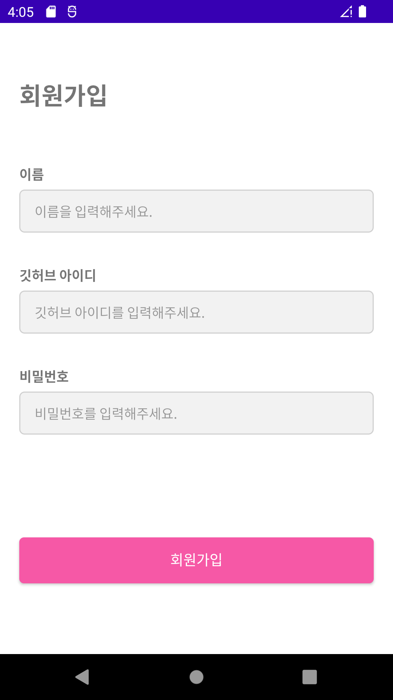
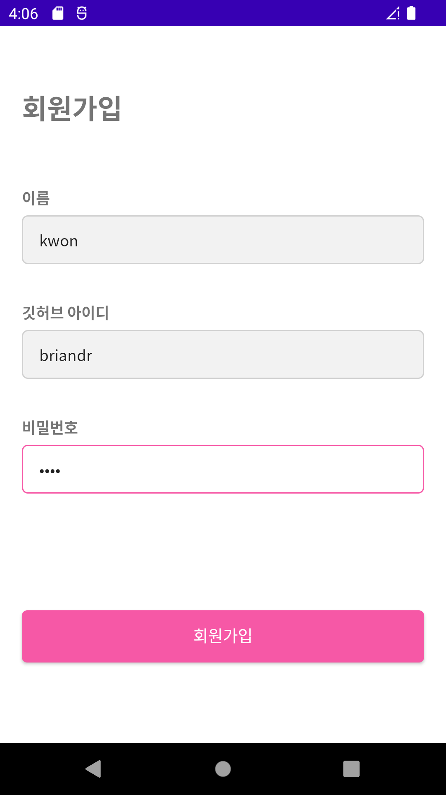
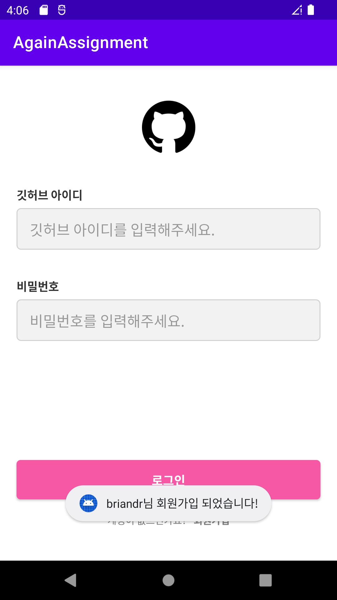
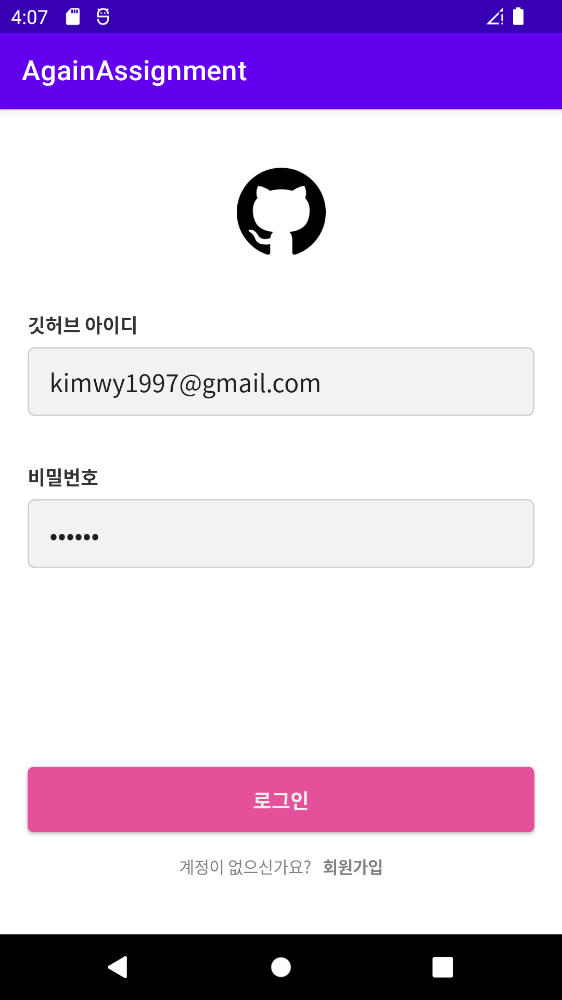
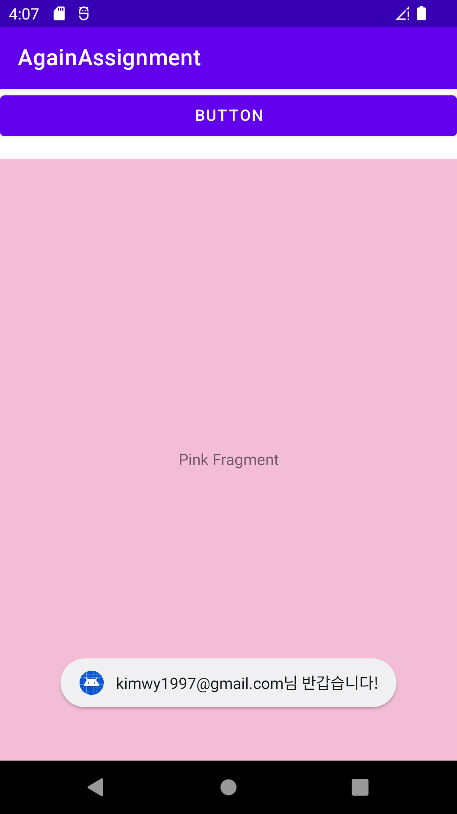
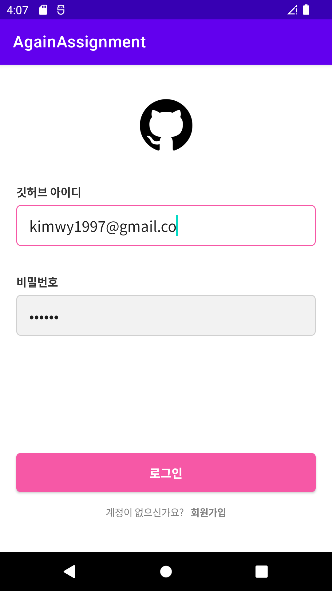
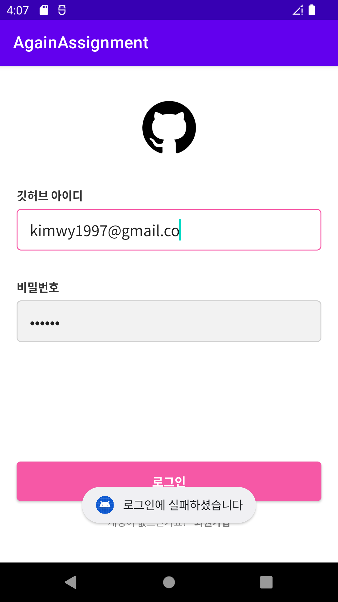
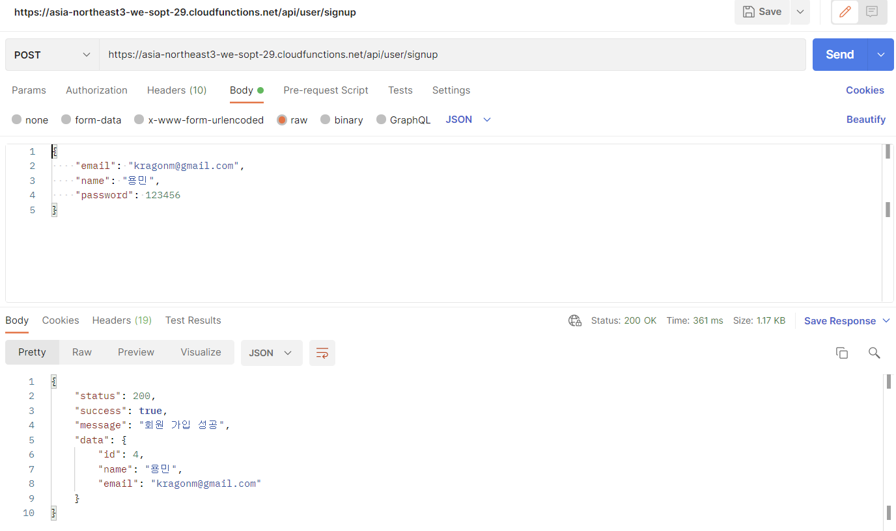

### 4주차 필수과제 리드미
먼저 3주차 과제를 오류로 실패하여 모든 것을 처음부터 새로 만들었습니다.<br>
그래서 맨 처음 화면인 로그인 화면과 회원가입 화면만 제대로 구성했고 로그인하면 나오는 화면은 제대로 제대로 구현하지 않았습니다.<br>
### 회원가입 화면
<br>
### 로그인 성공 화면
<br>
### 로그인 실패 화면
<br>
<br>
먼저 로그인 부분은 세미나에서 했던 그대로 했습니다.(액티비티 이름만 바꿔주었습니다.)<br>
그리고 로그인 부분을 응용해서 회원가입 부분을 만들었습니다.<br>
회원가입에 사용될 RequestData파일과 ResponseData파일을 새로 만들고<br>
_RequestData파일_<br>
```
data class RequestSignupData(
    @SerializedName("email")
    val id: String,
    val name: String,
    val password: String
)
```
_ResponseData파일_<br>
```
data class ResponseSignupData(
    val status: Int,
    val success: Boolean,
    val message: String,
    val data: Data2
)

data class Data2(
    val id: Int,
    val name: String,
    val email: String
)
```
근데 Response파일은 로그인 할 때나 회원가입할 때나 같은데 그냥 하나로 쓰면 안되나..?라는 궁금증이 갑자기 리드미 쓰면서 생기네요<br>
<br>
그리고 회원가입에 대한 interface를 만들었습니다.<br>
```
interface SignUp {
    @Headers("Content-Type:application/json")
    @POST("user/signup")
    fun postSignup(
        @Body body : RequestSignupData
    ) : Call<ResponseSignupData>
}
```
<br>
그리고 생성자에 val signup을 선언합니다.<br>

```
object ServiceCreator {
    private const val BASE_URL = "https://asia-northeast3-we-sopt-29.cloudfunctions.net/api/"

    private val retrofit : Retrofit = Retrofit.Builder()
        .baseUrl(BASE_URL)
        .addConverterFactory(GsonConverterFactory.create())
        .build()

    val sampleService: SampleService = retrofit.create(SampleService::class.java)
    val signup : SignUp = retrofit.create(SignUp::class.java)
}
```
<br>
회원가입 액티비티에서 사용할 initNetWork 함수를 만들었습니다.<br>
사실 로그인에서 사용했던 것에서 name만 추가하고 이름만 바꿔주면 됩니다,,<br>

```
private fun initNetwork(){
        val requestSignupData = RequestSignupData(
            id = binding.etSignupId.text.toString(),
            name = binding.etSignupName.text.toString(),
            password = binding.etSignupPw.text.toString()
        )

        val call: Call<ResponseSignupData> = ServiceCreator.signup.postSignup(requestSignupData)

        call.enqueue(object: Callback<ResponseSignupData> {
            override fun onResponse(
                call: Call<ResponseSignupData>,
                response: Response<ResponseSignupData>
            ) {
                if(response.isSuccessful){
                    val data = response.body()?.data

                    Toast.makeText(this@SignUpActivity, "${data?.email}님 회원가입 되었습니다!", Toast.LENGTH_SHORT).show()
                    finish()
                } else
                    Toast.makeText(this@SignUpActivity, "회원가입에 실패하셨습니다", Toast.LENGTH_SHORT).show()
            }

            override fun onFailure(call: Call<ResponseSignupData>, t: Throwable) {
                Log.e("NetWorkTest", "error:$t")
            }
        })
    }
```
<br>
+추가로 postman 이미지입니당,,<br>
<br>