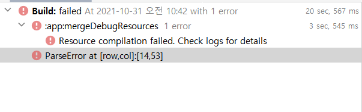
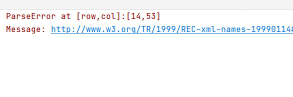
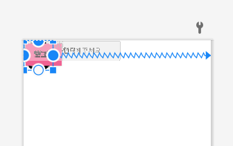

# 과제를 실패하고 쓰는 리드미...
세미나를 들을 때는 할 수 있을 줄 알았다. 할 수 있을 것처럼 보였다. 
근데 일단 과제 진행이 되기도 전에 알 수 없는 오류들로 과제를 진행할 수가 없었다,, 
하필 밤새서 새벽에해서 물어볼 사람도 없었다,,ㅠㅠ 
 
일단 이거.. 하단 네비게이션 넣은 뒤 이것저것 해보려고하는 순간.. 
저 오류가 계속 떠서 안됐다,, 구글링한 결과로는 manifest파일에서 일어나는 문제인 것 같은데 내 manifest파일 중 어디서 오류가 난건지 못찾았다. 
그래서 그냥 프로젝트를 새로 만들어서 코드 복사 붙여넣기를 시도했다. 
근데 MainActivity이름을 SignInActivity로 바꾸고 좀 하다보면 이번엔 manifest에서 .SignInActivity부분이 빨간줄이 뜨면서 액티비티로 인식을 못햇다.. 왜지?<bt>
그리고 계속 시도해보다가 이번엔 또 새로운 오류가 발생,, 
 
아니 모든 요소들 다 top bottom 중 하나, start end 중 하나씩 최소 두개의 제약을 모두 걸어줬는데 대체 왜? 
대체 왜 저렇게 겹치는거야,, 지금 내가 밤을 새서 머리가 안돌아가서 못찾는건지 진짜 오류가 어려운건지 모르겠다 
비록 실행은 안되지만,, 오류코드라도 제출하겠습니다 죄송함다,,,