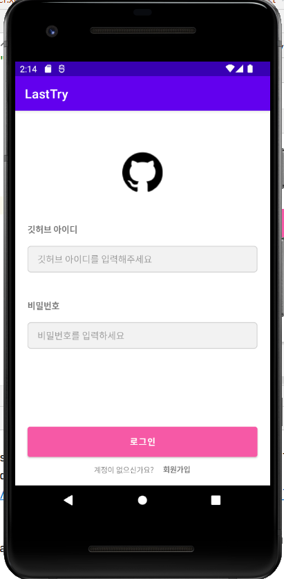

# 과제를 실패하고 쓰는 리드미...
세미나를 들을 때는 할 수 있을 줄 알았다. 할 수 있을 것처럼 보였다.<br>
근데 일단 과제 진행이 되기도 전에 알 수 없는 오류들로 과제를 진행할 수가 없었다,,<br>
하필 밤새서 새벽에해서 물어볼 사람도 없었다,,ㅠㅠ<br>
<br>
일단 이거.. 하단 네비게이션 넣은 뒤 이것저것 해보려고하는 순간..<br>
저 오류가 계속 떠서 안됐다,, 구글링한 결과로는 manifest파일에서 일어나는 문제인 것 같은데 내 manifest파일 중 어디서 오류가 난건지 못찾았다.<br>
그래서 그냥 프로젝트를 새로 만들어서 코드 복사 붙여넣기를 시도했다.<br>
근데 MainActivity이름을 SignInActivity로 바꾸고 좀 하다보면 이번엔 manifest에서 .SignInActivity부분이 빨간줄이 뜨면서 액티비티로 인식을 못햇다.. 왜지?<bt>
그리고 계속 시도해보다가 이번엔 또 새로운 오류가 발생,,<br>
<br>
아니 모든 요소들 다 top bottom 중 하나, start end 중 하나씩 최소 두개의 제약을 모두 걸어줬는데 대체 왜?<br>
대체 왜 저렇게 겹치는거야,, 지금 내가 밤을 새서 머리가 안돌아가서 못찾는건지 진짜 오류가 어려운건지 모르겠다<br>
비록 실행은 안되지만,, 오류코드라도 제출하겠습니다 죄송함다,,,<br>
<br>
<br>

오류는 아무래도 잡을 수가 없어서 맑은 정신으로 새 프로젝트로 만들어서 일단 레이아웃만 캡쳐해보았습니다.<br>
그래도 해놓은건 오류코드가 훨씬 많아서 오류코드로 제출할게융 ㅠㅠ<br>
<br>

시작화면입니다. 저거 세미나 자료에 있는대로
rectangle_fill_gray랑 rectangle_border_pink만들고 selector_sample_text만들어서 적용했는데<br>
selector_sample_text에 item부분에 빨간 밑줄이 뜨면서 color속성이 있어야한다고 막 그래서,,drawable대신 color가 들어와야한다고 그러는 것 같은데<br>
어떻게 고쳐야할지 몰라서
```
<?xml version="1.0" encoding="utf-8"?>
<selector xmlns:android="http://schemas.android.com/apk/res/android">
    <item android:color="#FFFFFF" android:state_focused="true" />
    <item android:color="#F2F2F2" android:state_focused="false" />
</selector>
```

```
<?xml version="1.0" encoding="utf-8"?>
<selector xmlns:android="http://schemas.android.com/apk/res/android">
    <item android:color="#F658A6" android:state_focused="true" />
    <item android:color="#D0D0D0" android:state_focused="false" />
</selector>
```

이런식으로 셀렉터를 두개 만들어서<br>
```
<?xml version="1.0" encoding="utf-8"?>
<shape xmlns:android="http://schemas.android.com/apk/res/android"
    android:shape="rectangle">

    <stroke android:width="1dp"
        android:color="@color/selector_edittext_border"/>

    <solid android:color="@color/selector_edittext"/>
    <corners android:radius="5dp"/>
</shape>
```
이렇게 적용해보았고 잘 작동했다.<br>
<br>
그리고 회원가입 버튼은 원래는 버튼이었는데 textView에 onClickListener붙여서 다시 만들었다.<br>
```
val intent = Intent(this, SignupActivity::class.java)
        binding.textView4.setOnClickListener{
            startActivity(intent)
        }
```
원래는 버튼만 onClickListener가 사용가능한줄 알았다. 근데 얼마전 안드로이드 왕초보 스터디에서 코드랩 보면서 공부하다가 textView에도 가능하다는 것을 알게 되었다,, (스터디짱!)<br>
<br>
<br>
<br>
다음은 회원가입창이다.
<br>
회원가입창도 같은 drawable과 selector파일 적용해주면서 똑같이 만들었다.<br>
아 그리고 버튼에도 적용하려고 drawable에 파일 만들었는데 왠걸 적용이 안됐다<br>
찾아보니까 버튼은 뭐가 안돼서 위젯버튼인가를 써야한다 뭐 그런 것 같은데 색을 직접입혔다.<br>
<br>
<br>
<br>
사진은 여기까지밖에 없다,, 어제 오류나기 전에 캡쳐좀 해놓을걸,,<br>
프로필, 홈, 카메라 있는 액티비티는 다 구현하지는 못했다<br>
그래도 버튼은 구현을 했는데,, 문제가 팔로워목록이 나올 때는 팔로워목록 버튼이 계속 오렌지 색으로 나와야하는데<br>
클릭할 때만 오렌지색이었다,, 이거는 뭔가 할 수 있을 것 같은데,, 일단은 못했다 그래서 버튼 누를 때만 오렌지색으로 나왔었다,,<br>
세미나 자료보면서 따로 스와이프되고 하단 내비게이션바가 달린 색깔만 들어가있는 액티비티는 만들었었는데 이걸 원래 있던 프로젝트랑 합치지는 못했다<br>
<br>
<br>
<br>
shapedrawable을 쓰는 건 1주차 과제 때 과제 사진이랑 똑같이 만들고 싶어서 구글링하면서 한 번 해봤었다.<br>
그 때는 뭔지도 모르고 그냥 오 이런게 있네,, 이러고 editText에 하얀색 바탕과 핑크색 경계선을 넣었었는데 뭔가 사용법을 다시 제대로 알게 된 것 같아서 좋다<br>
