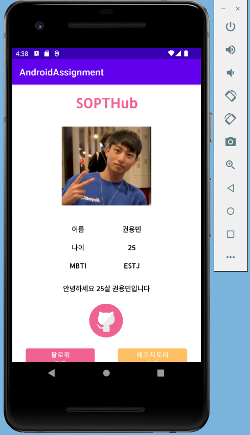
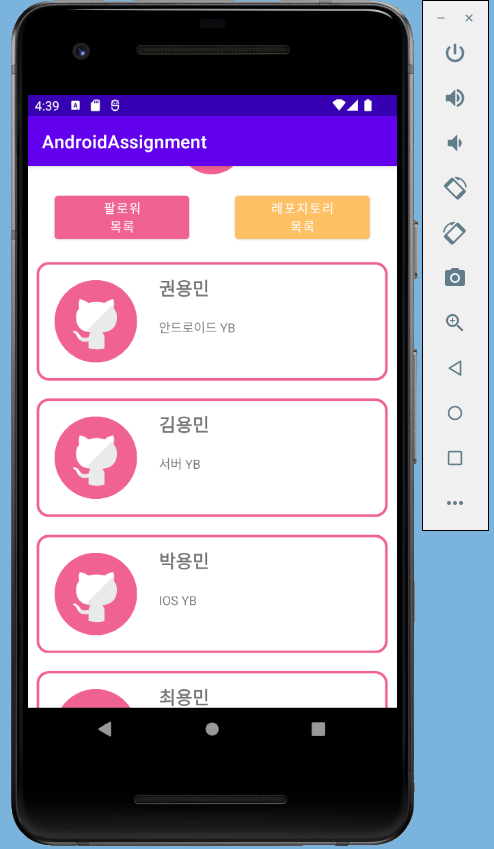
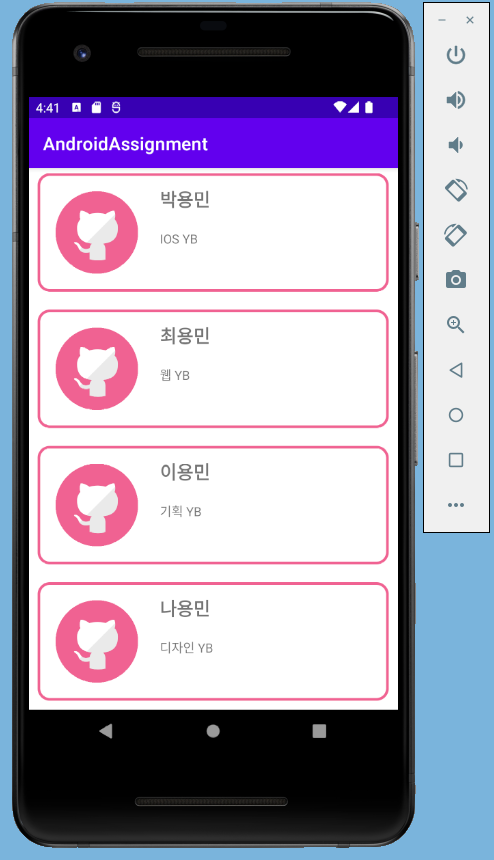
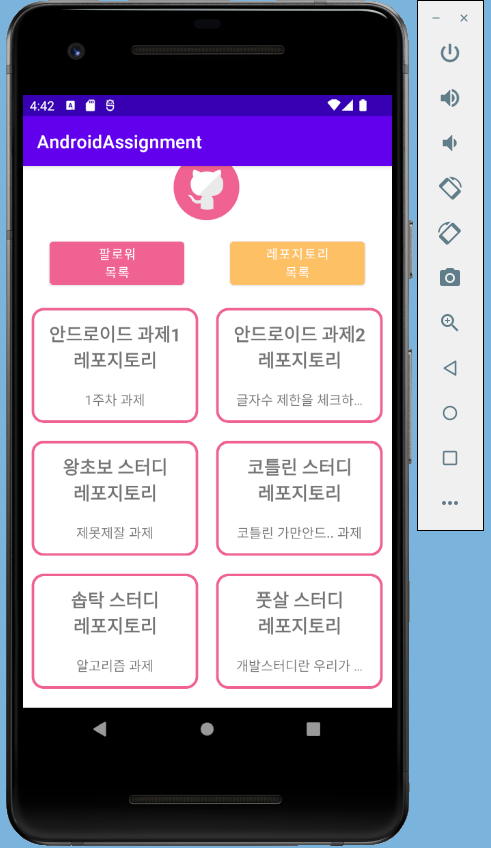
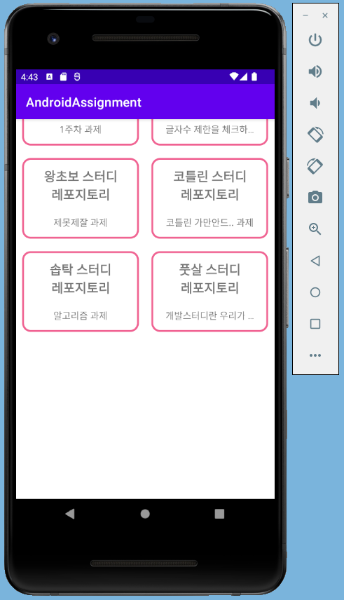

# LEVEL 1
2주나 주어졌지만.. 다음주는 내내 시험을 봐야하므로 사실상 1주,, <br>
다음 주에는 진짜 못할 것 같아서 이번 주에 우선 필수 과제만 끝내보았다.<br>
근데 사실 아직 세미나 때 배운 것을 이해를 못해서 마음으로는 하나하나 뜯어보며 배운 것을 맛보고 싶지만 시험기간이라 시간이 너무 없는 관계로 무지성 코딩,,,<br>
시험 끝나고부터는 기초부터 공부해서 세미나를 꼭 따라가야지,,<br>
<br>
1주차 과제에서 만들었던 스크롤뷰 위에 만들었습니다. 다만... recyclerview의 FragmentContainer의 height값을 수치로(700dp) 주는 바람에 아래와 같은 불상사가..<br>
 이렇게 밑부분이 남고 말았습니다.. 근데 저렇게 수치로 지정안하면 할당되는 영역이 없어져서,,, 어떻게 해야할지 몰라 그냥 수치로 지정해버렸습니다,,<br>
<br>
우선 recyclerview안에 넣을 아이템들의 xml파일부터 만들었습니다. git_follower_list가 팔로워들을 나타낼 아이템 디자인?이고, git_repository_list가 레포지토리들을 나타낼 아이템 디자인?입니다.<br>
그리고 fragment 파일 두 개를 만들었습니다. (FollowerList, fragment_follower_list), (RepositoryListFragment, fragment_repository_list)가 각각의 kt파일과 xml파일입니다.<br>
우선 xml파일부터 작성했습니다. 제약 레이아웃 안에 리사이클러 뷰를 넣고 app:layoutManager 속성을 통해서 linear와 grid 중 어떻게 보여줄지 정했습니다. tools:listitem 속성으로 아까 만든 아이템 디자인?과 연결했습니다.<br>
그리고는 세미나 때 했던 것과 그대로 따라하며 follower와 repository에 해당하는 data파일을 각각 만들고 adapter파일도 각각 만들었습니다.<br>
<br>
다만 세미나 때 했던 것과 달랐던 부분은 세미나 때는 recyclerview를 activity에 넣었다면 과제에서는 fragment에 넣었어야한다는 것, 버튼이 두 개라는 것, gridlayout을 사용해야한다는 것이었습니다.<br>
두 가지를 해결하기 위해 다음과 같은 코드를 사용했습니다.<br>
### recyclerview를 homeActivity에 넣기
recyclerview를 담은 fragment를 만들고 homeActivity에 fragmentContainer를 넣어주었습니다. 여기서 height가 말썽을 부려 700dp로 고정해주었습니다.<br>
이제 버튼이 두 개로 늘어난 문제를 해결해야했는데 follower에 대한 fragment가 띄워져 있을 때에 follower 버튼 클릭에 대한건 설정해주지 않아도 된다고 생각했는데 설정해주지 않으니 두 번 클릭했을 때 앱이 튕겼습니다.<br>
그래서 시행착오를 여러가지 거치며 결국 버튼 두 개에 대해 각각 setOnClickListener를 설정하고 그 안에서 세미나 때 했던 것처럼 position 변수와 when절을 사용하여 position이 어떤 경우이든 해당 버튼이 원하는 fragment로 가도록 설정해주었습니다.<br>
_뭔가 이게 아닌 것 같지만.. 더 좋은 효율적인 방법이 있을 것 같지만 성공해낸게 이거밖에 없어서,,_<br>
<br>
그리고 각 fragment의 kt파일에서 세미나 때와 같이 initAdapter함수를 만들고 세미나에서는 activity에 넣었기 때문에 onCreate에 넣었지만 과제는 Fragment였기에 onCreateView의(?) View?에서 함수를 호출했습니다.<br>
하지만 repository에 관한 fragment는 gridLayout을 적용해줘야했고 이것이 난관이었습니다. 다른 설정을 추가로 해주지 않으니 linear하게 화면에 출력되었습니다.<br>
그래서 인터넷을 찾고 찾다가,, 다음처럼 코드를 짜게 되었습니다.
```
    ): View? {
        _binding = FragmentRepositoryListBinding.inflate(layoutInflater, container, false)
        initAdapter()
        binding.rvRepository.adapter = repositoryAdapter
        binding.rvRepository.layoutManager=GridLayoutManager(activity, 2)
        return binding.root
    }
```
추가한 것은 initAdapter() 다음 binding으로 시작하는 두 줄입니다.<br>
여기서 문제는 GridLayoutManager의 인자로 activity와 2를 넣어주었는데 activity자리에 계속 구글링 코드 따라서 this를 넣었다가 오류가 났었습니다.
그러다가 this는 acitivity에 되고 fragment에서는 activity를 사용해야한다는 것을 배우고.. 다행히 성공,,<br>
이렇게 성공하게되었습니다.<br>
아! 그리고 repository의 text에 대해서는 ellipsize 속성을 넣어주어야했습니다!<br>
처음에는 android:maxLength="10" android:ellipsize="end"를 사용하여 시도했는데 10글자까지 제한하긴 하지만 초과되는 부분이 ...으로 표현되지 않고 그대로 잘리게 되었습니다.<br>
그래서 찾고 찾다가 ems와 maxLines 속성을 알게되어
```
        android:ems="9"
        android:maxLines="1"
        android:ellipsize="end"
```
다음과 같이 적용해주니 공백을 포함하지 않은 10글자로 제한하고 초과하는 텍스트는 ...으로 처리해주게되었습니다.<br>
ems 항목이 9인 것은 10으로 했더니 11글자가 출력돼서 9로 설정했습니다.<br>

+ 과제가 10글자가 아니고 일정길이로 업데이트 되었지만,, 이미 10글자로 설정해버린 관계로... 10글자도 일정길이니까.. 안바꿔도 되겠죠? <br>

<br>
이렇게 필수과제를 마쳤습니다... 사실 더 공부해서 다 하고싶지만...<br>
시험 끝난 뒤를 기약해보는걸로.. 목표는 앱잼 때 1인분하기입니다.<br>
안드 왕초보, 안린이, 코틀린 왕초보 권용민 화이팅..!
